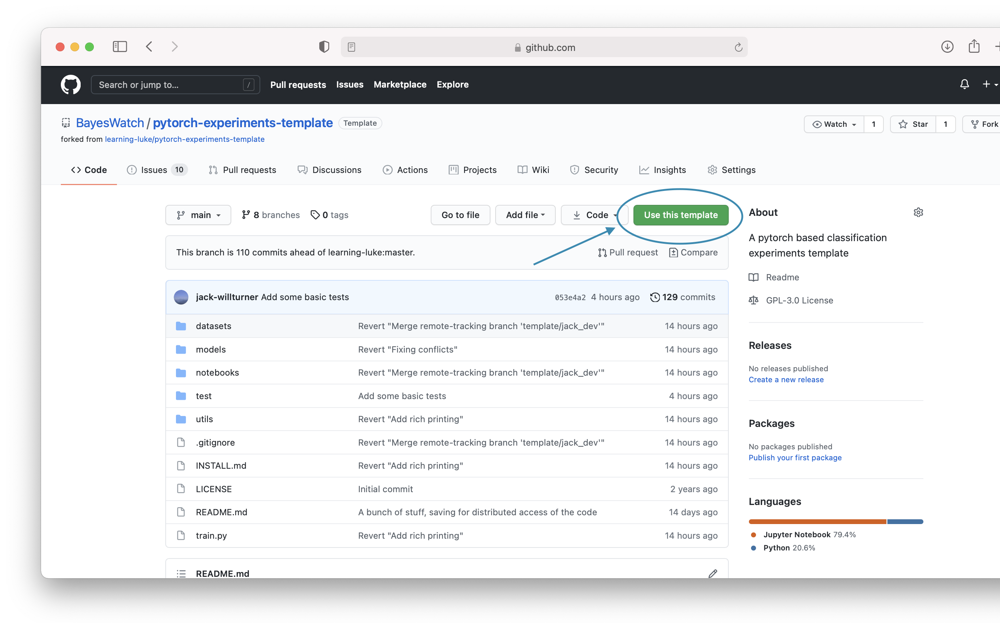

=========================
Installation and Overview
=========================

We encourage the use of `conda` to get setup. Our current preference is for `miniforge <https://github.com/conda-forge/miniforge>`_.

If you are working on the Edinburgh GPU machines you will want to set your conda home to be in scratch space (i.e. start by doing ``cd /disk/scratch/``, then ``mkdir YOURNAME``, ``cd YOURNAME``, and then install conda).

------------------
Setup Instructions
------------------
Assuming you already have conda available, installing the dependencies of this template should be as easy as:

``conda env create --name NAME --file environment.yml``

Where ``NAME`` is of your choice.

Then:

``conda activate NAME``

------------------
Using the template
------------------

In order to use this template, go to the GitHub repository and click the "Use this template" button:

Then you will want to clone and ``cd`` into your new repository.

++++++++
Optional
++++++++

You can also set a ``datasets`` directory that the repository will read from. In order to do this you will need to add a line to your ``.bashrc`` (or whichever shell you are using) that looks like:

``export PYTORCH_DATA_LOC=/disk/scratch_ssd/``

This, for instance, is the data location I have set on one of our remote machines. I have it set differently on my personal laptop, so I never need to change config files or pass extra args to move between machines.

Assuming you are in the base directory of the repository, you can then run

``pytest``

to verify that things are working on your machine.

--------
Overview
--------
When you first download the repository, it should look something like this::

  ├── INSTALL.md
  ├── LICENSE
  ├── README.md
  ├── experiment_files
  ├── datasets
  |   ├── dataset_loading_hub.py
  |   ├── custom_transforms.py
  ├── log
  ├── models
  │   ├── __init__.py
  │   ├── auto_builder_models.py
  │   ├── densenet.py
  │   ├── resnet.py
  │   └── wresnet.py
  ├── notebooks
  │   ├── plot-results.ipynb
  │   └── utils.py
  ├── test
  │   └── auto_builder_models_test.py
  ├── train.py
  └── utils
      ├── arg_parsing.py
      ├── cinic_utils.py
      ├── gpu_selection_utils.py
      ├── metric_tracking.py
      ├── storage.py
      └── torchsummary.py

The core of this template exists in:

* ``train.py`` - where the training logic and hyperparameters live
* ``datasets/`` - where all the dataset loading happens (including augmentations)
* ``models/`` - where the models are built (either via ``auto_builder_models`` or through the ``model_zoo``)

All of the extra neat features in the repository live in the ``utils/`` folder, such as:
* automated metric tracking
* automated gpu selection
* some useful extensions to argparse

Checkpoints and metric files will be saved in ``log``.

Configurations for running experiments via ``json`` files are stored in ``experiment_files``.

We also encourage you to write tests for your code and put them in ``test/`` (although we ourselves are guilty of not staying on top of this).
